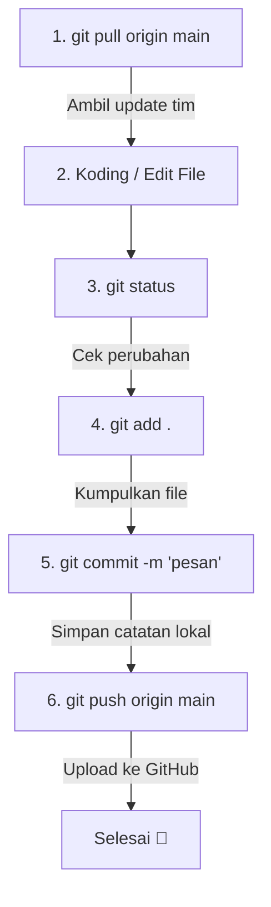

# 🚀 Belajar Git untuk Persiapan PBL (Project Based Learning)

Selamat datang di panduan **Belajar Git**! Panduan ini dirancang khusus agar **pemula (beginner-friendly)** dapat memahami konsep dasar kontrol versi (version control) menggunakan Git dan GitHub secara cepat dan praktis.

---

## 📌 Mengapa Belajar Git?

Saat mengerjakan proyek tim (seperti **PBL / Pemrograman Web**), kita sering perlu berbagi kode, menggabungkan fitur baru, atau mengembalikan kode jika ada error. Git membantu kita mencatat setiap riwayat perubahan kode tanpa perlu membuat folder backup manual seperti `project_v1`, `project_v2_final`, dst.

---

## 🧩 3 Perintah Utama yang Wajib Dikuasai

### 1. 📥 `git clone` (Mengunduh Repository)
* **Apa itu?**  
  `git clone` digunakan untuk mendownload/menyalin seluruh isi repository remote (yang ada di GitHub) ke dalam komputer lokal kamu untuk pertama kali.
* **Kapan digunakan?**  
  Saat kamu baru mulai bergabung ke dalam tim PBL atau ingin mengambil sampel proyek dari GitHub ke laptop kamu.

---

## 📋 Panduan Step-by-Step Penggunaan

### 🔹 Scenario A: Cara Melakukan `git clone` (Mengunduh Repository Pertama Kali)

Lakukan langkah ini **hanya sekali** saat kamu baru pertama kali mengambil proyek dari GitHub ke laptop kamu.

1. **Buka halaman repository di GitHub** melalui browser.
2. Klik tombol hijau **`< > Code`**, lalu salin (copy) link URL HTTPS repository-nya (contoh: `https://github.com/username/nama-repository.git`).
3. **Buka Terminal / Git Bash / Command Prompt** di folder komputer tempat kamu ingin menyimpan proyek.
4. **Jalankan Perintah Clone:**
   ```bash
   git clone https://github.com/username/nama-repository.git
   ```
5. **Masuk ke folder proyek yang baru ter-download:**
   ```bash
   cd nama-repository
   ```
6. **Buka di VS Code:**
   ```bash
   code .
   ```
7. **Selesai!** Seluruh isi proyek dari GitHub sekarang sudah ada di laptop kamu.

---

### 🔹 Scenario B: Cara Melakukan `git pull` (Mengambil Update Kode Tim)

Lakukan langkah ini **setiap kali kamu ingin mulai koding** agar kode di laptopmu selalu paling baru.

1. **Buka Terminal / Git Bash** di dalam folder proyek kamu.
2. **Cek status proyek lokal (Opsional):**
   ```bash
   git status
   ```
   *Pastikan tidak ada perubahan yang belum di-commit.*
3. **Jalankan Perintah Pull:**
   ```bash
   git pull origin main
   ```
   *(Catatan: Jika branch utama kamu bernama `master`, gunakan `git pull origin master`)*
4. **Selesai!** Jika berhasil, terminal akan menampilkan daftar file yang berhasil di-update dari GitHub.


---

### 🔹 Scenario C: Cara Melakukan `git push` (Mengirim Kerjakan ke GitHub)

Lakukan langkah ini **setelah kamu selesai membuat / mengubah kode** dan ingin menyimpannya ke GitHub.

1. **Langkah 1: Cek file yang telah kamu ubah**
   ```bash
   git status
   ```
   *Terminal akan menampilkan file berwarna merah (artinya file tersebut baru diubah/ditambahkan).*

2. **Langkah 2: Tandai file yang akan disimpan (`git add`)**
   ```bash
   git add .
   ```
   *(Titik `.` artinya kamu memasukkan semua file yang berubah ke staging area).*

3. **Langkah 3: Simpan perubahan dengan pesan penjelasan (`git commit`)**
   ```bash
   git commit -m "feat: menambahkan struktur dasar index.html"
   ```
   *Tulis pesan dalam tanda kutip yang mendeskripsikan apa yang kamu kerjakan.*

4. **Langkah 4: Unggah ke GitHub (`git push`)**
   ```bash
   git push origin main
   ```
   *Perubahan kamu sekarang sudah tampil secara live di repository GitHub!*

---

## 🔄 Alur Lengkap Koding Sehari-hari (Daily Workflow)

Gabungan dari semua langkah di atas yang biasa dipakai oleh developer:



### Urutan Command di Terminal:
```bash
# 1. Sebelum mulai koding, update dulu
git pull origin main

# --- [Kamu ngetik / edit kode di VS Code] ---

# 2. Setelah selesai koding, jalankan urutan ini:
git status
git add .
git commit -m "perbaikan tampilan header"
git push origin main
```

---

## 🛠️ Cheatsheet Perintah Berguna Lainnya

| Perintah | Kegunaan |
| :--- | :--- |
| `git status` | Melihat status file (apakah ada perubahan yang belum di-commit) |
| `git log --oneline` | Melihat riwayat commit secara singkat |
| `git config --list` | Melihat konfigurasi nama dan email Git kamu |

---

## 🎯 Tips Penting untuk Tim PBL
> [!TIP]
> **Kebiasaan Baik Pengguna Git:**
> 1. **Pull Dulu Sebelum Koding**: Selalu jalankan `git pull origin main` setiap hari sebelum mulai ngetik kode baru.
> 2. **Pesan Commit Jelas**: Tulis pesan commit yang mendeskripsikan perubahan dengan singkat dan jelas.
> 3. **Push Secara Berkala**: Jangan menunda push sampai kodingan terlalu banyak agar menghindari *merge conflict* dengan teman tim.

